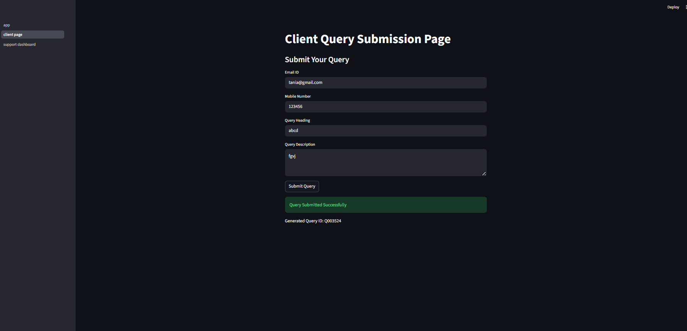
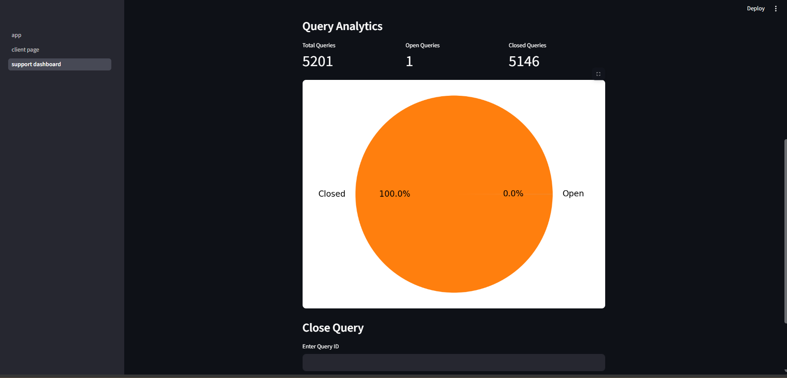
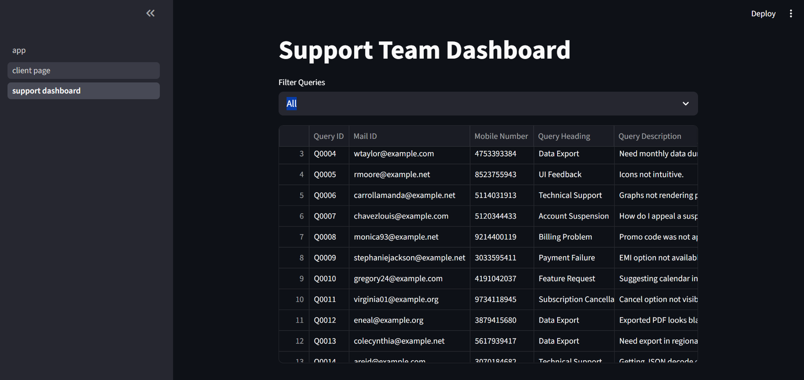

# Client Query Management System

A Streamlit + MySQL based project for managing customer support queries.

---

# Features

- Client query submission form
- Store queries in MySQL database
- Support dashboard
- Query filtering
- Query analytics with pie chart
- Close query functionality

---

# Technologies Used

- Python
- Streamlit
- MySQL
- Pandas
- Matplotlib

---

# Project Structure

```text
client_query_management/
│
├── pages/
│   ├── client_page.py
│   └── support_dashboard.py
│
├── images/
│   ├── analytics_dashboard.png
│   ├── client_submission.png
│   └── query_table.png
│
├── app.py
├── db_config.py
├── insert_data.py
├── query_operations.py
├── requirements.txt
└── README.md
```

---

# Screenshots

## Client Query Submission Page



---

## Support Dashboard Analytics



---

## Query Table



---

# How to Run Project

## Activate Virtual Environment

```bash
.\venv\Scripts\activate
```

## Install Dependencies

```bash
pip install -r requirements.txt
```

## Run Streamlit App

```bash
streamlit run app.py
```

---

# Database

- MySQL database used
- Dataset imported using `insert_data.py`

---

# Author

Tania Banerjee